# Screensaver Studio (`omarchy-screensaver-studio`)

> **Unofficial / Community Plugin**: An independent multi-mode screensaver suite for Omarchy.

A native Wayland screensaver engine with 10 generative visual modes, OLED burn-in prevention, dynamic Omarchy theme synchronization, real-time PipeWire audio spectrum visualization, and full integration with Quickshell's idle monitor and Omarchy launcher menus — running under application ID `org.omarchy.screensaver`.

This project was developed through an AI-assisted workflow. The concept, customization, configuration, testing, integration, and final iteration were directed and carried out by me.

---

## My Contribution

I did not write Omarchy, Quickshell, Hyprland, GTK4, or PipeWire from scratch. What I contributed:

- **Plugin Architecture**: Designed and structured this as a conformant Omarchy plugin with `manifest.json` and `BarWidget.qml` following the Omarchy plugin conventions.
- **Python GTK4/Cairo Screensaver Engine**: Designed and implemented the multi-mode screensaver as a native GTK4 Wayland window under application ID `org.omarchy.screensaver` (integrates with Hyprland window rules and Quickshell's `IdleMonitor`). Core modules: `app.py`, `window.py`, `modes/`, `theme.py`, `config.py`.
- **15 Signature Visual Modes**: Authored all visual mode rendering logic:
  - `clock`: Minimalist floating typographic clock with celestial orbital aura, date, and battery status.
  - `matrix`: 3D parallax cybernetic rain with authentic Katakana glyphs, hex numbers, and phosphor decay.
  - `particles`: Volumetric cosmic constellation with wandering gravitational attractor.
  - `warp`: Relativistic 3D starfield hyperspace jump with speed streaks and depth scaling.
  - `geometry`: Hypnotic 4D rotating hypercube (tesseract) with depth cueing and chromatic glow.
  - `singularity`: Kerr rotating black hole with relativistic Doppler-beamed accretion disk.
  - `system`: Digital Cockpit Speedometer Telemetry Cluster — Automotive instrument cluster with precision tachometers (CPU, GPU, RAM), dynamic voltage & amperage badges, dual-trace Bezier 60-second activity sparkline, and an elevated 3-column precision telemetry deck (`ELECTRICAL & POWER` with CPU/GPU/Total SoC/DRAM wattage/volts/amps, `STORAGE & MEMORY I/O` with live NVMe read/write MB/s, IOPS, lifetime transfer totals, and RAM bus bandwidth, and `KERNEL & RUNTIME` with 16-thread queue capacity and load averages).
  - `terminal`: Borderless diagnostic waterfall streaming live Linux kernel and procfs metrics.
  - `visualizer`: Floating reactive equalizer bars with real-time PipeWire spectrum and MPRIS metadata.
  - `aurora`: Multi-octave harmonic spline ribbons with celestial stardust motes.
  - `cyber_nexus`: Subtle glowing neural nodes connected by pulsing data lines in deep OLED black.
  - `synthwave`: 3D perspective retro wireframe horizon with gentle neon gradient sun.
  - `quantum_helix`: Dual rotating DNA/quantum strands with orbital stardust motes.
  - `topography`: Dynamic topographic contour elevation lines undulating smoothly in dark ambient space.
  - `celestial_orbit`: Gravitational multi-orbital planetary system with planetary trails.
- **OLED Burn-in Protection**: Implemented true `#000000` black subpixel shutoff mode with continuous imperceptible orbital coordinate drift to safeguard OLED/AMOLED displays.
- **Ambient Study Display Mode**: Created dedicated ambient study display toggle with sleep/lock inhibition and touch immunity (shortcut: `SUPER + I`), plus live audio visualizer toggle (`SUPER + T` / `'t'`).
- **Dynamic Palette Synchronizer**: Designed `theme.py` to inherit color schemes dynamically from the active Omarchy `colors.toml` or built-in presets (`aurora`, `cyberpunk`, `matrix`, `minimal`, `osaka`) with 100% theme harmony.
- **Real-Time PipeWire Audio Spectrum Engine**: Native C PipeWire audio monitor (`audio_spectrum.c` compiled into `libomarchy_audio.so`) running at native 48,000 Hz with 36 continuous-frequency Goertzel filters, progressive acoustic tilt equalization for full dynamic response across all 36 bands (40 Hz - 11.5 kHz), sub-10ms latency, and study mode visualizer toggle (`SUPER + T` / keypress `'t'`).
- **Idle Lifecycle Integration**: Wired `Service.qml` (Quickshell) to trigger the screensaver via `omarchy-launch-screensaver` wrapper and `shell.json` configuration. Wake dismissal (key press, mouse motion, click) cancels idle cycles.
- **Interactive Menu Suite & Extensions**: Designed the floating modal HUD selector (`omarchy-menu-screensaver`), keyboard-driven terminal manager (`omarchy-screensaver-menu` via Gum), CLI state manager (`omarchy-screensaver-select`), and `omarchy-menu-extension.jsonc` for Omarchy application launcher integration.
- **Bar Widget**: Implemented `BarWidget.qml` showing screensaver mode and controls in the Omarchy top bar.
- **Theme Definitions**: Authored `themes/` directory with per-mode color palette overrides.
- **Performance Tuning**: Optimized rendering for AMD Ryzen 7 PRO 5850U integrated Vega graphics (<1% total CPU, ~55 MB RAM at 60 FPS).
- **Installer**: Authored `./install.sh` with timestamped backup manifests.
- **Testing**: Tested all 15 modes on Omarchy 4.0.2 / Quickshell 0.3.1 / GTK4 Wayland / Hyprland 0.56.2.

---

## Based On / Credits

- **[Omarchy](https://github.com/basecamp/omarchy)** — The open-source Arch Linux desktop environment and plugin system by Basecamp. This plugin uses the Omarchy plugin manifest format, bar widget API, and idle lifecycle integration.
- **[Quickshell](https://quickshell.outfoxxed.me)** — The Qt6 QML Wayland layer-shell desktop shell. `Service.qml` connects to Quickshell's `IdleMonitor` for automatic idle triggering.
- **[Hyprland](https://hyprland.org)** — The Wayland compositor. Window rules target `org.omarchy.screensaver` for fullscreen/float placement.
- **GTK4 / PyGObject / Cairo** — The native Wayland rendering toolkit used for all visual modes.
- **[PipeWire](https://pipewire.org)** — The audio server. The optional audio spectrum engine captures audio via `libpulse-simple` from PipeWire's PulseAudio compatibility layer.

**Related Repos**:
- [omarchy-system-pulse](https://github.com/aarushdalal/omarchy-system-pulse) — System telemetry and audio dashboard
- [omarchy-focus-hub](https://github.com/aarushdalal/omarchy-focus-hub) — Pomodoro and focus session manager
- [omarchy-aesthetic-themes](https://github.com/aarushdalal/omarchy-aesthetic-themes) — Anime color themes (palettes used by screensaver)

---

## Plugin Manifest

This repository includes a valid `manifest.json` for the Omarchy plugin system:

```json
{
  "schemaVersion": 1,
  "id": "daemon0.screensaver-studio",
  "name": "Screensaver Studio",
  "version": "1.2.0",
  "author": "Daemon0",
  "description": "15-mode screensaver suite (clock, matrix, particles, warp, geometry, singularity, terminal, system, visualizer, aurora, cyber_nexus, synthwave, quantum_helix, topography, celestial_orbit) with sub-second startup, low resource overhead, Quickshell, audio spectrum, and menu integration",
  "kinds": ["bar-widget"],
  "entryPoints": { "barWidget": "BarWidget.qml" },
  "barWidget": {
    "displayName": "Screensaver Studio",
    "category": "Desktop",
    "allowMultiple": false,
    "defaultSection": "right"
  }
}
```

---

## Status / Experimental Warning

This project contains native Python GTK4 rendering code and optional C extensions. **Pre-compiled binary objects (`.so`) are excluded from the public repository.** Build tools (`gcc`, `libpulse`) are required only if you want real-time audio reactivity. Framerate, rendering overhead, and battery consumption vary by GPU driver and CPU architecture.

---

## Features

- **Sub-Second Latency & Low Resource Consumption**: Instant startup ($\le 0.45$s) using deferred background subsystem initialization and optimized lightweight rendering loops.
- **15 Signature Visual Modes**:
  - `clock`: Minimal typographic clock with orbital aura
  - `matrix`: 3D Katakana & hex cybernetic cascading rain with glyph caching
  - `particles`: Volumetric constellation network with wandering attractor (clamped to 90 particles for low CPU load)
  - `warp`: Relativistic starfield warp with perspective streaks (300 stars)
  - `geometry`: 4D rotating hypercube (tesseract) with depth cueing
  - `singularity`: Kerr black hole with Doppler-beamed accretion disk (220 particles)
  - `terminal`: Borderless holographic diagnostic stream
  - `system`: Digital Cockpit Speedometer Telemetry Cluster — Automotive tachometers, live CPU/GPU/SoC/DRAM electrical rails (W, V, A), real-time NVMe read/write speeds, IOPS, and lifetime stats, memory bus bandwidth (GB/s), and 16-thread run queue capacity
  - `visualizer`: Real-time PipeWire audio spectrum & MPRIS metadata
  - `aurora`: Harmonic Perlin spline ribbons with stardust motes (20 FPS smooth flow)
  - `cyber_nexus`: Subtle glowing neural nodes connected by pulsing data lines in deep OLED black
  - `synthwave`: 3D perspective retro wireframe horizon with gentle neon gradient sun
  - `quantum_helix`: Dual rotating DNA/quantum strands with orbital stardust motes
  - `topography`: Dynamic topographic contour elevation lines undulating smoothly in dark ambient space
  - `celestial_orbit`: Gravitational multi-orbital planetary system with planetary trails
- **OLED True-Black Mode**: `#000000` subpixel shutoff with continuous micro-drift protection
- **Dual-OS Integration**: Unified controls and synchronized launcher menus across both Omarchy and DaemonOS (`SUPER + CTRL + I` and `SUPER + I`)
- **Dynamic Palette Synchronizer**: Inherits color schemes from the active Omarchy theme (`colors.toml`) or built-in presets
- **Interactive Floating HUD**: `omarchy-menu-screensaver` modal menu and top-bar integration
- **Terminal TUI Manager**: `omarchy-screensaver-menu` powered by Gum
- **Omarchy Menu Integration**: Bundled `omarchy-menu-extension.jsonc` adds direct screensaver controls into Omarchy launcher menus
- **Idle Lifecycle Integration**: App ID `org.omarchy.screensaver` — integrates with Quickshell idle services, dismisses instantly on input
- **Real-Time Audio Spectrum**: Optional C/PipeWire backend with 36 Goertzel filters, sub-10ms latency

### Advanced System Telemetry Cockpit (v1.6.0)

The `system` mode provides an automotive-grade telemetry cluster engineered for technical depth, zero visual jitter, and 100% theme harmony:

```text
                                     20:46:40
                  // SYSTEM TELEMETRY HUD — THURSDAY · 08 OCTOBER 2026

        ( CPU LOAD )                     ( GPU LOAD )                     (  MEMORY  )
           45.6%                            77.0%                            70.7%
       1.86 GHz · 74°C                  400 MHz · 71°C                  10.6 / 14.9 GB
AMD Ryzen 7 PRO 5850U · 0.98V · 2.8A  VRAM 480/512 MB · 0.89V · 6.0A   FREE 4.4G · SWAP 1.6G ( 5%)

   SYSTEM ACTIVITY (60s)  ~~~~~~~~~~~~~~~~~~~~~~~~~~~~~~~~~~~~~~  CPU 45.6%  ·  GPU 77.0%

 ● ELECTRICAL & POWER          ● STORAGE & MEMORY I/O         ● KERNEL & RUNTIME
 CPU RAIL   2.7W · 0.98V · 2.8A  SSD NVMe   127/186 GB (68%) · 36°C KERNEL     7.2.3-arch1-3
 GPU RAIL   5.3W · 0.89V · 6.0A  SSD READ   ↓  0.0 MB/s ·     0 IOPS LOAD AVG   6.59 · 6.54 · 6.40 (16C)
 TOTAL SoC  8.0W · 0.82V · 9.8A  SSD WRITE  ↑  1.5 MB/s ·   113 IOPS LOAD QUEUE QUEUE: 6.6 RUNNABLE / 16C (41%)
 DRAM POWER 1.7W · 1.20V · 1.4A  SSD TOTAL  17.6G R · 29.0G W (2.05M IO) NETWORK    ↓ 4K/s ↑ 69K/s [wlp1s0]
 BATTERY    100% · 12.8V · 0.0A [FULL] MEM BUS    10.6G ACT · 4.4G FREE  GOVERNOR   amd-pstate-epp · UP 6h 7m
 AC SUPPLY  ONLINE · LINE PASS-THROUGH [AC] MEM SPEED  ↔ 0.25 GB/s · 0.1M PG/s HOST/USER  daemon0@Daemon0
```

#### Detailed HUD Field Reference & What Each Value Means

##### 1. Instrument Tachometer Dials & Badges (Center Section)
| Display Field | Example Value | Description & Technical Source |
|---|---|---|
| **`CPU LOAD` Dial** | `45.6%` | Total normalized CPU core utilization across all 16 execution threads (parsed from `/proc/stat`). |
| **`CPU Clock & Temp`** | `1.86 GHz · 74°C` | Live average core clock frequency (`/proc/cpuinfo`) and package die temperature from `k10temp` / `zenpower`. |
| **`CPU Spec Badge`** | `AMD Ryzen 7 PRO 5850U · 0.98V · 2.8A` | Processor model, dynamic core rail voltage ($V_{\text{core}}$), and instantaneous CPU amperage ($I_{\text{core}} = P_{\text{cpu}} / V_{\text{core}}$). |
| **`GPU LOAD` Dial** | `77.0%` | Active Radeon Vega 8 graphics engine load from `/sys/class/drm/card0/device/gpu_busy_percent`. |
| **`GPU Clock & Temp`** | `400 MHz · 71°C` | Current GPU core clock speed (`pp_dpm_sclk`) and edge/junction temperature from `amdgpu` hwmon. |
| **`GPU Spec Badge`** | `VRAM 480/512 MB · 0.89V · 6.0A` | Allocated video RAM used vs reserved, graphics rail voltage ($V_{\text{gfx}}$ from `in0_input`), and VRM current ($I_{\text{gfx}}$). |
| **`MEMORY` Dial** | `70.7%` | Physical RAM consumption percentage: $(\text{MemTotal} - \text{MemAvailable}) / \text{MemTotal}$. |
| **`RAM Allocation`** | `10.6 / 14.9 GB` | Active memory in use vs total system memory capacity (from `/proc/meminfo`). |
| **`RAM Spec Badge`** | `FREE 4.4G · SWAP 1.6G ( 5%)` | Immediately reclaimable/free memory headroom plus active swap utilization and percentage. |

##### 2. 60-Second Activity Sparkline
| Display Field | Example Value | Description & Technical Source |
|---|---|---|
| **`SYSTEM ACTIVITY (60s)`** | Smooth Bezier Curve | 60-sample historical trace showing CPU load (primary theme color) and GPU load (secondary accent) with zero rendering lag. |
| **`Sparkline Legend`** | `CPU 45.6% · GPU 77.0%` | Instantaneous readings corresponding to the latest recorded timestamp on the right edge of the chart. |

##### 3. Column 1: `● ELECTRICAL & POWER`
| Row Key | Example Value | Description & Technical Source |
|---|---|---|
| **`CPU RAIL`** | `2.7W · 0.98V · 2.8A` | Real-time CPU core package power draw ($W$), dynamic core rail voltage ($V$), and core amperage ($A$). |
| **`GPU RAIL`** | `5.3W · 0.89V · 6.0A` | Real-time integrated GPU power draw ($W$), graphics rail voltage ($V$), and GPU VRM current ($A$). |
| **`TOTAL SoC`** | `8.0W · 0.82V · 9.8A` | Total AMD package power draw ($P_{\text{soc}}$), Northbridge/SoC voltage ($V_{\text{soc}}$), and combined package current ($I_{\text{soc}}$). |
| **`DRAM POWER`** | `1.7W · 1.20V · 1.4A` | Physical DRAM power draw ($W$), JEDEC DDR4 rail voltage ($1.20\text{V}$), and DRAM current ($A$) calibrated across dual DIMMs and active page swaps. |
| **`BATTERY`** | `100% · 12.8V · 0.0A [FULL]` | Battery state of charge (%), terminal pack voltage ($V$), charging/discharging current ($A$), and battery charge status. |
| **`AC SUPPLY`** | `ONLINE · LINE PASS-THROUGH [AC]` | AC mains connection status and power delivery mode from `/sys/class/power_supply/ACAD`. |

##### 4. Column 2: `● STORAGE & MEMORY I/O`
| Row Key | Example Value | Description & Technical Source |
|---|---|---|
| **`SSD NVMe`** | `127/186 GB (68%) · 36°C` | Root storage partition disk space used vs total capacity, utilization percentage, and NVMe controller temperature. |
| **`SSD READ`** | `↓ 0.0 MB/s · 0 IOPS` | Real-time disk read throughput ($\text{MB/s}$) and active read operations per second (`IOPS`) derived from delta parsing of `/proc/diskstats`. |
| **`SSD WRITE`** | `↑ 1.5 MB/s · 113 IOPS` | Real-time disk write throughput ($\text{MB/s}$) and active write operations per second (`IOPS`). |
| **`SSD TOTAL`** | `17.6G R · 29.0G W (2.05M IO)` | Cumulative lifetime storage metrics since boot: total reads (`GB R`), total writes (`GB W`), and total I/O transactions (`M IO`). |
| **`MEM BUS`** | `10.6G ACT · 4.4G FREE` | Memory allocation breakdown: active in-use pages allocated to processes vs unallocated/free memory pages. |
| **`MEM SPEED`** | `↔ 0.25 GB/s · 0.1M PG/s` | Live memory bus transfer bandwidth ($\text{GB/s}$) and virtual memory page transaction rate ($\text{M PG/s}$) from `/proc/vmstat`. |

##### 5. Column 3: `● KERNEL & RUNTIME`
| Row Key | Example Value | Description & Technical Source |
|---|---|---|
| **`KERNEL`** | `7.2.3-arch1-3` | Active Linux kernel release string running on Arch Linux. |
| **`LOAD AVG`** | `6.59 · 6.54 · 6.40 (16C)` | 1-min, 5-min, and 15-min moving load averages. In Linux, this counts both CPU runnable state (`R`) and uninterruptible disk/NVMe I/O sleep (`D`). `(16C)` represents hardware capacity ceiling. |
| **`LOAD QUEUE`** | `QUEUE: 6.6 RUNNABLE / 16C (41%)` | Instant capacity engagement: 6.6 active runnable/uninterruptible threads relative to 16 hardware execution threads (41% capacity engaged). |
| **`NETWORK`** | `↓ 4K/s ↑ 69K/s [wlp1s0]` | Real-time downstream ($\downarrow$) and upstream ($\uparrow$) network throughput and active network interface name. |
| **`GOVERNOR`** | `amd-pstate-epp · UP 6h 7m` | Active CPU frequency scaling governor / energy performance preference (`amd-pstate-epp`) and system uptime. |
| **`HOST/USER`** | `daemon0@Daemon0` | Host machine hostname and active user session identifier. |

---

## Showcase Gallery

All 15 visual modes feature animated previews generated directly from the automated showcase suite (click any preview to view the full 60 FPS WebM recording):

| Mode | Live Animated Preview | Visual Description |
|---|---|---|
| `aurora` | <a href="assets/showcase/aurora.webm"></a> | Multi-octave harmonic spline ribbons with stardust motes |
| `celestial_orbit` | <a href="assets/showcase/celestial_orbit.webm">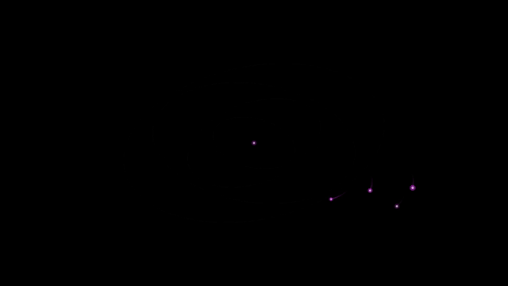</a> | Gravitational multi-orbital planetary system with trajectory trails |
| `clock` | <a href="assets/showcase/clock.webm">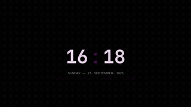</a> | Floating typographic clock with orbital aura & telemetry |
| `cyber_nexus` | <a href="assets/showcase/cyber_nexus.webm">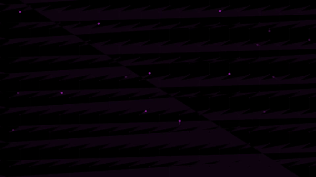</a> | OLED true-black neural node constellation with data pulses |
| `geometry` | <a href="assets/showcase/geometry.webm">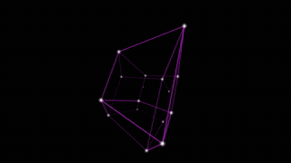</a> | 4D rotating tesseract with chromatic depth glow |
| `matrix` | <a href="assets/showcase/matrix.webm">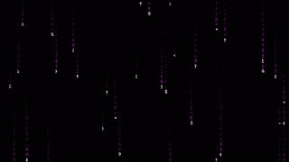</a> | 3D parallax Katakana digital rain & phosphor decay |
| `particles` | <a href="assets/showcase/particles.webm"></a> | Volumetric cosmic constellation with wandering attractor |
| `quantum_helix` | <a href="assets/showcase/quantum_helix.webm">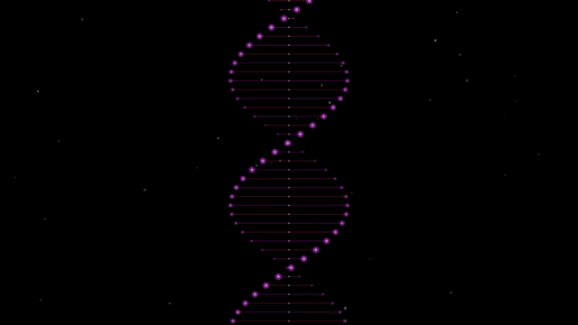</a> | Dual counter-rotating quantum double-helix strands |
| `singularity` | <a href="assets/showcase/singularity.webm">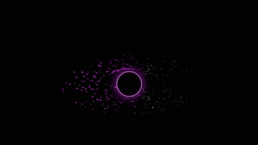</a> | Kerr rotating black hole with Doppler accretion disk |
| `synthwave` | <a href="assets/showcase/synthwave.webm">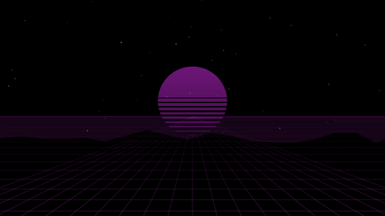</a> | 3D wireframe perspective neon horizon & gradient sun |
| `system` | <a href="assets/showcase/system.webm">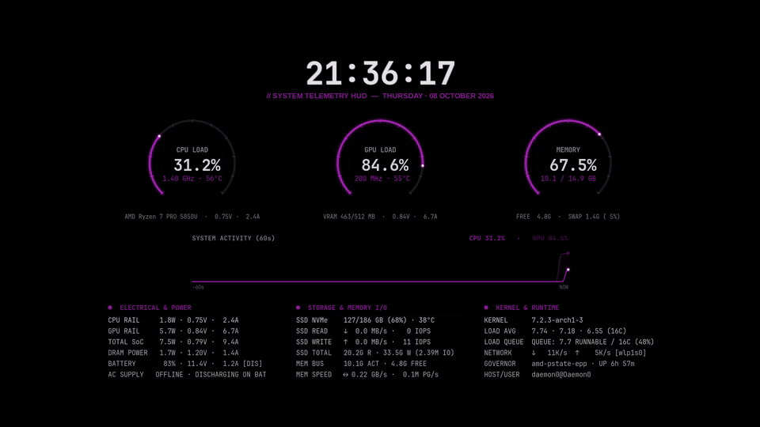</a> | Digital Cockpit HUD with tachometers, electricals & IOPS |
| `terminal` | <a href="assets/showcase/terminal.webm">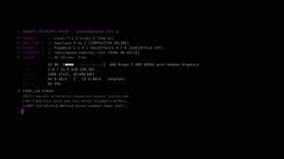</a> | Diagnostic kernel & procfs metric waterfall |
| `topography` | <a href="assets/showcase/topography.webm">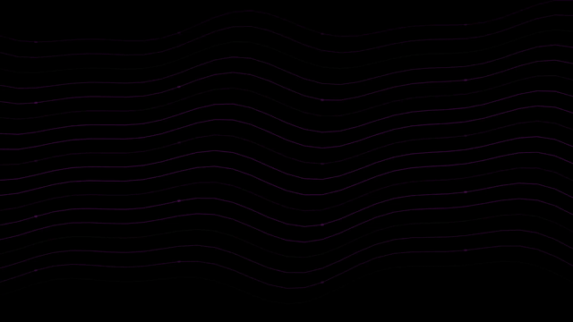</a> | Fluid undulating topographic elevation contour lines |
| `visualizer` | <a href="assets/showcase/visualizer.webm">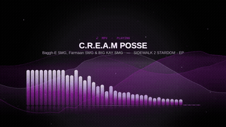</a> | Real-time PipeWire audio spectrum equalizer bars |
| `warp` | <a href="assets/showcase/warp.webm">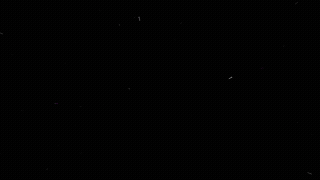</a> | Relativistic 3D starfield hyperspace jump streaks |


---

## Requirements

- **Operating System**: Arch Linux (rolling release, x86_64)
- **Desktop Shell**: Omarchy (`dev (13f18b2c) / 4.0.2`) with Quickshell (`0.3.1`)
- **Compositor**: Hyprland (`0.56.2`)
- **Runtime Dependencies**: `python3`, `gtk4`, `python-gobject`, `cairo`, `jq`
- **Optional (for Audio Spectrum)**: `pipewire-pulse`, `libpulse`, `gcc`
- **Optional (for Terminal TUI)**: `gum`

---

## Compatibility

| Component | Tested Version | Compatibility Status |
|---|---|---|
| Omarchy | `dev (13f18b2c) / 4.0.2` | Fully compatible |
| Quickshell | `0.3.1` | Fully compatible |
| Hyprland | `0.56.2` | Fully compatible |
| GTK | GTK4 Wayland | Fully compatible |

---

## Installation

### Method 1: Using Omarchy Plugin Manager (Recommended)

```bash
omarchy plugin add https://github.com/aarushdalal/omarchy-screensaver-studio.git --enable
```

### Method 2: Using the Safe User Installer

```bash
git clone https://github.com/aarushdalal/omarchy-screensaver-studio.git
cd omarchy-screensaver-studio

./install.sh check
./install.sh install --dry-run
./install.sh install
```

---

## System Setup Before Installation

1. Install GTK4 PyGObject dependencies:
   ```bash
   sudo pacman -S gtk4 python-gobject cairo jq
   ```
2. Optional — audio development headers for the spectrum visualizer:
   ```bash
   sudo pacman -S libpulse base-devel
   ```
3. Optional — terminal TUI manager:
   ```bash
   sudo pacman -S gum
   ```

---

## Configuration Guide

See [**docs/CONFIGURATION.md**](docs/CONFIGURATION.md) for detailed per-mode TOML parameter specifications, theme overrides, and OLED settings.

---

## Usage

- **Preview Any Mode for 5 Seconds**:
  ```bash
  omarchy-screensaver-preview matrix 5
  omarchy-screensaver-preview warp 5
  omarchy-screensaver-preview geometry 5
  omarchy-screensaver-preview singularity 5
  ```
- **Open Interactive Mode HUD**:
  ```bash
  omarchy-menu-screensaver
  ```
- **Open Terminal TUI Manager**:
  ```bash
  omarchy-screensaver-menu
  ```
- **Switch Default Mode**:
  ```bash
  omarchy-screensaver-select mode singularity
  ```
- **Toggle Ambient Study Display**:
  ```bash
  omarchy-screensaver-toggle
  ```

---

## Update

```bash
omarchy plugin update daemon0.screensaver-studio
```

---

## Uninstall

```bash
./install.sh uninstall
# Or:
omarchy plugin remove daemon0.screensaver-studio --yes
```

---

## Security and Privacy

- No external network requests are made.
- Audio capture (if enabled) analyzes local frequency amplitudes only and never records, stores, or transmits audio streams.

---

## Contributing

Contributions are welcome!

---

## License

[MIT License](LICENSE).

---

## Credits / Third-Party Notices

- Built for the [Omarchy](https://github.com/basecamp/omarchy) desktop environment.
- Powered by [Quickshell](https://quickshell.outfoxxed.me/), [Hyprland](https://hyprland.org/), GTK4, and [PipeWire](https://pipewire.org/).
- Not an official Omarchy product.
